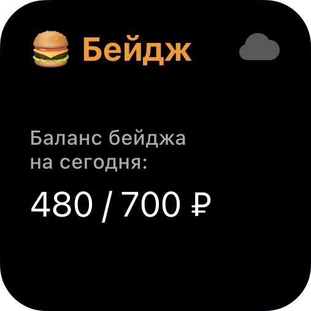
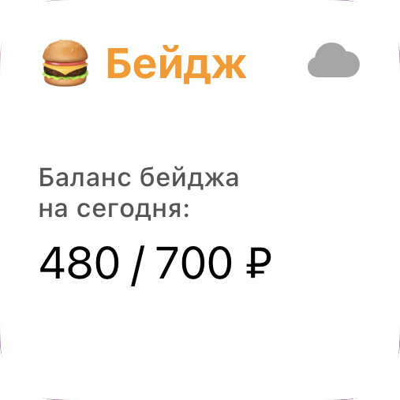
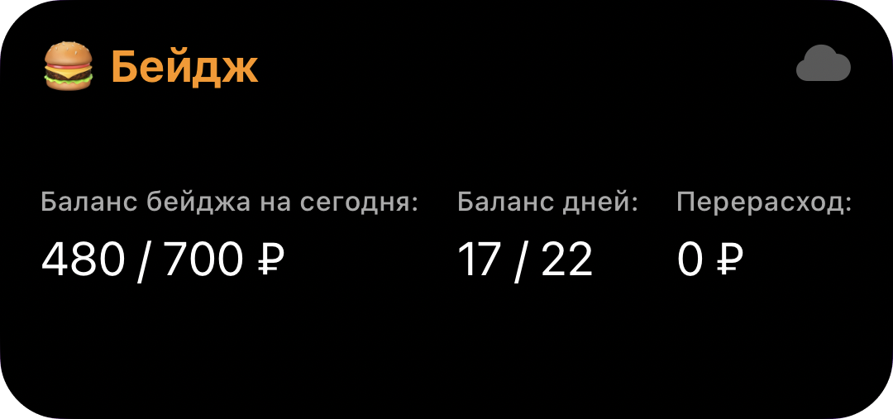
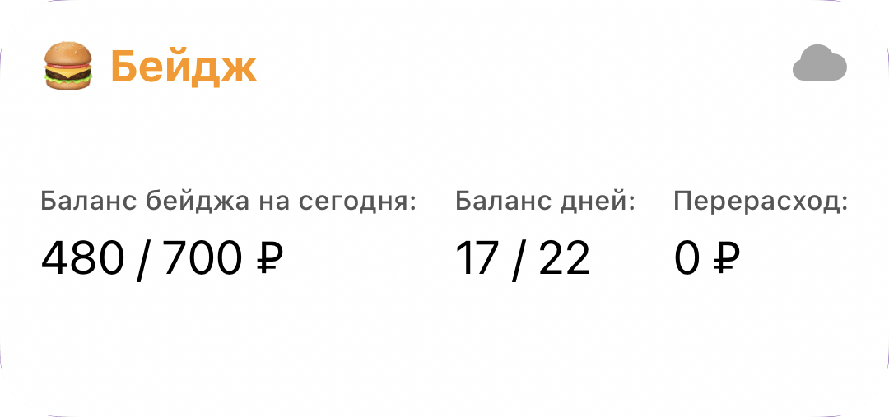
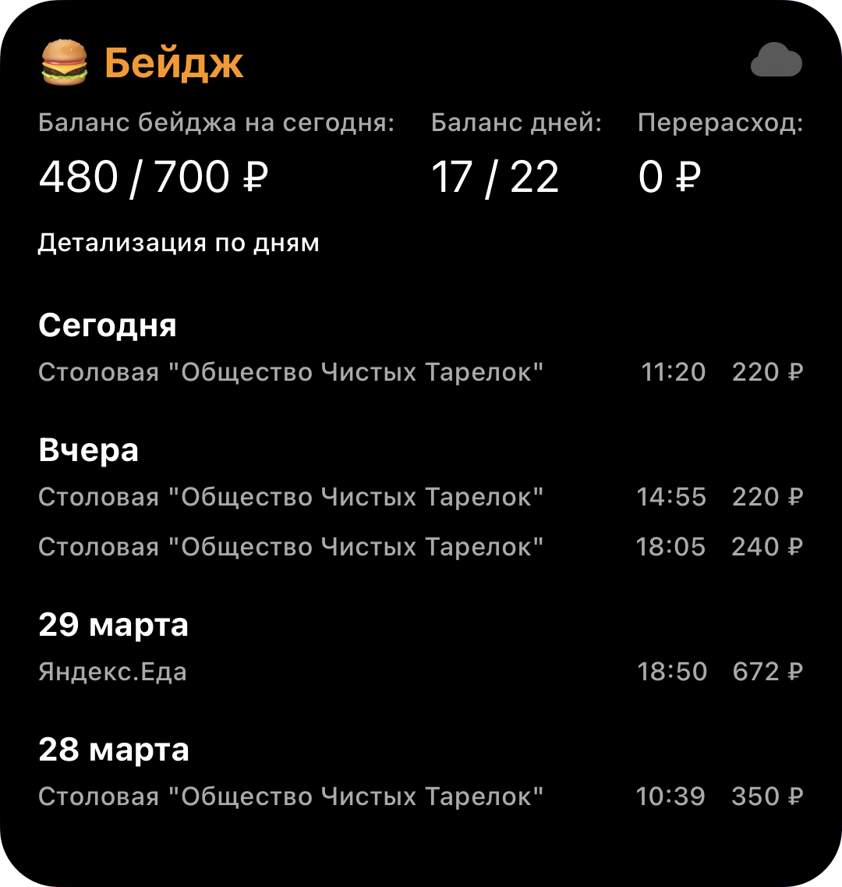
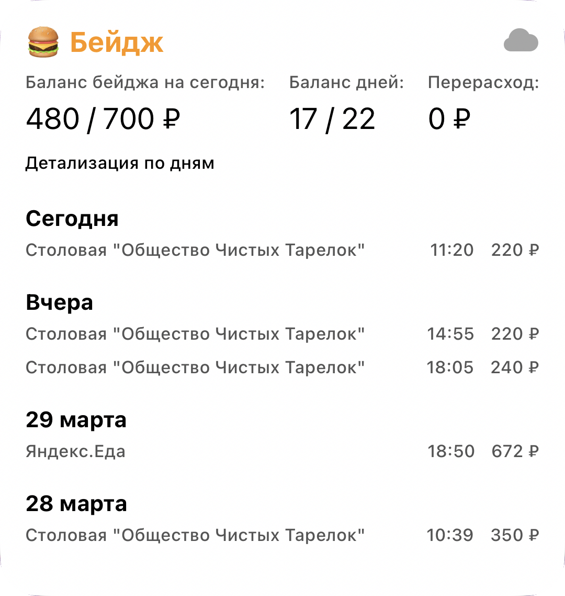

# Яндекс Бейдж

Удобный способ отслеживания баланса бейджа для сотрудников Яндекса!

Работает на базе [Scriptable](https://scriptable.app/)

## Виджеты

| Размер виджета   | Тёмная тема                              | Светлая тема                               |
|------------------|------------------------------------------|--------------------------------------------|
| Small            |      |      |
| Medium           |    |    |
| Large/ExtraLarge |  |  |

Так же есть варианты настройки большого виджета:

| Описание                      | Настройки                                                                                                                                           | Отображение                                                                                                                                             |
|-------------------------------|-----------------------------------------------------------------------------------------------------------------------------------------------------|---------------------------------------------------------------------------------------------------------------------------------------------------------|
| Показ всех заказов            |  |    |
| Показ последний **N** заказов |        |  |

## Дополнительные варианты отображения

Так же у данного скрипта есть возможность через Siri в виде таблицы:

Или при запуске самого скрипта из приложения/нажатия на виджет:

